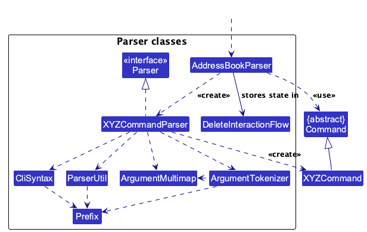
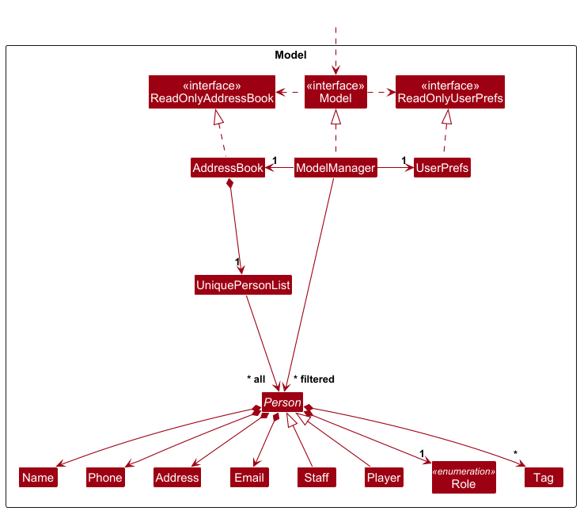
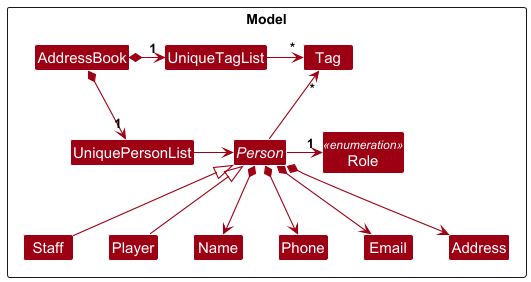
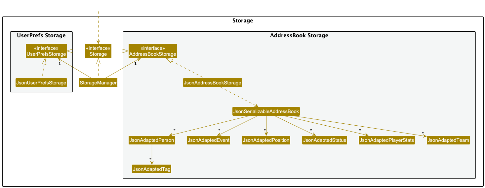
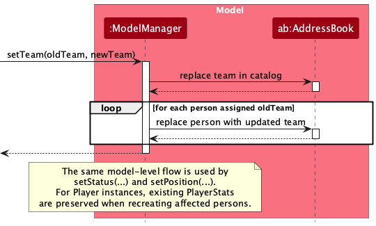
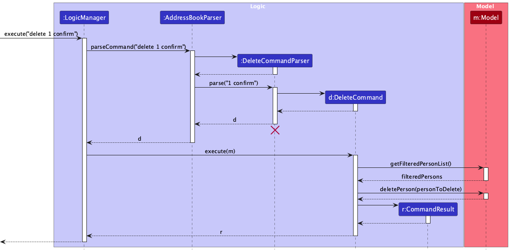
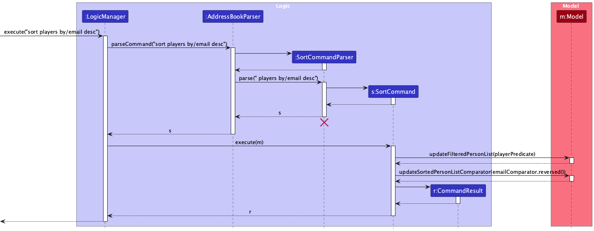

* Table of Contents
  {:toc}

--------------------------------------------------------------------------------------------------------------------

## **Acknowledgements**

* {list here sources of all reused/adapted ideas, code, documentation, and third-party libraries -- include links to the
  original source as well}

--------------------------------------------------------------------------------------------------------------------

## **Setting up, getting started**

Refer to the guide [_Setting up and getting started_](SettingUp.md).

--------------------------------------------------------------------------------------------------------------------

## **Design**

:bulb: **Tip:** The `.puml` files used to create diagrams are in this document `docs/diagrams` folder. Refer to the [
_PlantUML Tutorial_ at se-edu/guides](https://se-education.org/guides/tutorials/plantUml.html) to learn how to create
and edit diagrams.

### Architecture

The ***Architecture Diagram*** given above explains the high-level design of the App.

Given below is a quick overview of main components and how they interact with each other.

**Main components of the architecture**

**`Main`** (consisting of classes [
`Main`](https://github.com/se-edu/addressbook-level3/tree/master/src/main/java/seedu/address/Main.java) and [
`MainApp`](https://github.com/se-edu/addressbook-level3/tree/master/src/main/java/seedu/address/MainApp.java)) is in
charge of the app launch and shut down.

* At app launch, it initializes the other components in the correct sequence, and connects them up with each other.
* At shut down, it shuts down the other components and invokes cleanup methods where necessary.

The bulk of the app's work is done by the following four components:

* [**`UI`**](#ui-component): The UI of the App.
* [**`Logic`**](#logic-component): The command executor.
* [**`Model`**](#model-component): Holds the data of the App in memory.
* [**`Storage`**](#storage-component): Reads data from, and writes data to, the hard disk.

[**`Commons`**](#common-classes) represents a collection of classes used by multiple other components.

**How the architecture components interact with each other**

The *Sequence Diagram* below shows how the components interact with each other for the scenario where the user issues
the command `delete 1`.

Each of the four main components (also shown in the diagram above),

* defines its *API* in an `interface` with the same name as the Component.
* implements its functionality using a concrete `{Component Name}Manager` class (which follows the corresponding API
  `interface` mentioned in the previous point.

For example, the `Logic` component defines its API in the `Logic.java` interface and implements its functionality using
the `LogicManager.java` class which follows the `Logic` interface. Other components interact with a given component
through its interface rather than the concrete class (reason: to prevent outside component's being coupled to the
implementation of a component), as illustrated in the (partial) class diagram below.

The sections below give more details of each component.

### UI component

The **API** of this component is specified in [
`Ui.java`](https://github.com/se-edu/addressbook-level3/tree/master/src/main/java/seedu/address/ui/Ui.java)

The UI consists of a `MainWindow` that is made up of parts e.g.`CommandBox`, `ResultDisplay`, `PersonListPanel`,
`StatusBarFooter` etc. All these, including the `MainWindow`, inherit from the abstract `UiPart` class which captures
the commonalities between classes that represent parts of the visible GUI.

The `UI` component uses the JavaFx UI framework. The layout of these UI parts are defined in matching `.fxml` files that
are in the `src/main/resources/view` folder. For example, the layout of the [
`MainWindow`](https://github.com/se-edu/addressbook-level3/tree/master/src/main/java/seedu/address/ui/MainWindow.java)
is specified in [
`MainWindow.fxml`](https://github.com/se-edu/addressbook-level3/tree/master/src/main/resources/view/MainWindow.fxml)

The `UI` component,

* executes user commands using the `Logic` component.
* listens for changes to `Model` data so that the UI can be updated with the modified data.
* keeps a reference to the `Logic` component, because the `UI` relies on the `Logic` to execute commands.
* depends on some classes in the `Model` component, as it displays `Person` object residing in the `Model`.

### Logic component

**API** : [
`Logic.java`](https://github.com/se-edu/addressbook-level3/tree/master/src/main/java/seedu/address/logic/Logic.java)

Here's a (partial) class diagram of the `Logic` component:

The sequence diagram below illustrates the interactions within the `Logic` component, taking
`execute("delete 1 confirm")` as an example. This is the confirmed follow-up command produced by the parser's
multi-step delete interaction flow after the user first selects a player for deletion.

:information_source: **Note:** The lifeline for `DeleteCommandParser` should end at the destroy marker (X) but due to a limitation of PlantUML, the lifeline continues till the end of diagram.

How the `Logic` component works:

1. When `Logic` is called upon to execute a command, it is passed to an `AddressBookParser` object which in turn creates
   a parser that matches the command (e.g., `DeleteCommandParser`) and uses it to parse the command.
1. This results in a `Command` object (more precisely, an object of one of its subclasses e.g., `DeleteCommand`) which
   is executed by the `LogicManager`.
1. The command can communicate with the `Model` when it is executed (e.g. to delete a person). 
   Note that although this is shown as a single step in the diagram above (for simplicity), in the code it can take
   several interactions (between the command object and the `Model`) to achieve.
1. The result of the command execution is encapsulated as a `CommandResult` object which is returned back from `Logic`.

Here are the other classes in `Logic` (omitted from the class diagram above) that are used for parsing a user command:

How the parsing works:

* When called upon to parse a user command, the `AddressBookParser` class creates an `XYZCommandParser` (`XYZ` is a
  placeholder for the specific command name e.g., `AddCommandParser`) which uses the other classes shown above to parse
  the user command and create a `XYZCommand` object (e.g., `AddCommand`) which the `AddressBookParser` returns back as a
  `Command` object.
* `AddressBookParser` also keeps a `DeleteInteractionFlow` helper to support multi-step follow-up inputs for
  `delete` and `deletebulk`. This allows inputs such as `y`, `n`, or a clash-selection index to be rewritten into a
  concrete command before normal parsing continues.
* All `XYZCommandParser` classes (e.g., `AddCommandParser`, `DeleteCommandParser`, ...) inherit from the `Parser`
  interface so that they can be treated similarly where possible e.g, during testing.

### Model component

**API** : [
`Model.java`](https://github.com/se-edu/addressbook-level3/tree/master/src/main/java/seedu/address/model/Model.java)

The `Model` component,

* stores the address book domain data, including `Person` objects, `Event` objects, and the
  `Team`/`Status`/`Position` attribute catalogs.
* `Person` is an abstract class that is extended by `Player` and `Staff` classes.
* stores the currently 'selected' `Person` objects (e.g., results of a search query) as a separate _filtered_ list which
  is exposed to outsiders as an unmodifiable `ObservableList<Person>` that can be 'observed' e.g. the UI can be bound to
  this list so that the UI automatically updates when the data in the list change.
* stores a `UserPref` object that represents the user’s preferences. This is exposed to the outside as a
  `ReadOnlyUserPref` objects.
* does not depend on any of the other three components (as the `Model` represents data entities of the domain, they
  should make sense on their own without depending on other components)

The overview model diagrams in this section focus on the person-role structure and intentionally omit
event and attribute-catalog details to keep the diagrams readable. Those details are documented later
in the feature-specific implementation sections.

:information_source: **Note:** An alternative (arguably, a more OOP) model is given below. It has a `Tag` list in the `AddressBook`, which `Person` references. This allows `AddressBook` to only require one `Tag` object per unique tag, instead of each `Person` needing their own `Tag` objects. 

### Storage component

**API** : [
`Storage.java`](https://github.com/se-edu/addressbook-level3/tree/master/src/main/java/seedu/address/storage/Storage.java)

The `Storage` component,

* can save both address book data and user preference data in JSON format, and read them back into corresponding
  objects.
* inherits from both `AddressBookStorage` and `UserPrefStorage`, which means it can be treated as either one (if only
  the functionality of only one is needed).
* depends on some classes in the `Model` component (because the `Storage` component's job is to save/retrieve objects
  that belong to the `Model`)

### Common classes

Classes used by multiple components are in the `seedu.address.commons` package.

--------------------------------------------------------------------------------------------------------------------

## **Implementation**

This section describes some noteworthy details on how certain features are implemented.

### Role-filtered list command

For role-filtered `list` input, `AddressBookParser` delegates to `ListCommandParser`.
A bare `list` command still returns `ListCommand` directly.
For role-only input such as `list r/player` or `list r/staff`,
`ListCommandParser` creates a `ListRoleCommand` with the corresponding role predicate.

When executed, `ListRoleCommand` calls `Model#updateFilteredPersonList(...)` with
`PersonHasRolePredicate(Role.PLAYER)` or `PersonHasRolePredicate(Role.STAFF)`, which updates the
observable filtered list shown in the UI.

The sequence diagram below illustrates the interaction flow using `execute("list r/player")` as the example.

:information_source: **Note:** The lifeline for `ListCommandParser` should end at the destroy marker (X) but due to a limitation of PlantUML, the lifeline continues till the end of diagram.

### Structured filter command

The `filter` command is implemented as a predicate-based list narrowing operation.

* `FilterCommandParser` parses optional role, team, status, and position criteria, together with optional numeric
  comparisons for `goals`, `wins`, and `losses`.
* Parsed criteria are assembled into `PersonMatchesFilterPredicate`, which combines all supplied filters with
  AND semantics.
* `FilterCommand` applies that predicate through `Model#updateFilteredPersonList(...)`.
* Stat comparisons only match players; non-player entries do not satisfy `goals`, `wins`, or `losses` filters.

The following sequence diagram illustrates `filter r/player pos/Forward goals/>10`.

### Attribute-filtered list command

For attribute-filtered input such as `list tm/First Team` or
`list r/player st/Active pos/Defender`, `ListCommandParser` creates a
`ListFilteredCommand` instead of a `ListRoleCommand`.

Implementation details:
* `ListCommandParser` tokenizes the optional `r/`, `tm/`, `st/`, and `pos/` prefixes.
* If only `r/` is present, it returns `ListRoleCommand` to preserve the simpler role-only flow.
* If any attribute filter is present, it builds a `PersonMatchesListFiltersPredicate` with the
  provided optional role, team, status, and position values.
* `ListFilteredCommand` then calls `Model#updateFilteredPersonList(...)` with that composite
  predicate, updating the observable filtered list shown in the UI.

The corresponding sequence-diagram source for the filtered path is recorded in
`docs/diagrams/ListFilteredSequenceDiagram.puml`.

### Update player stats command

The `update` command (`set` command works similarly) is handled by the `AddressBookParser` via the `UpdateCommandParser`,
which creates a `UpdateCommand` with the given parameters (`INDEX, STAT, VALUE`).

After updating the player stats with the relevant setter function in `PlayerStats`, it refreshes the observable filtered list
by calling `Model#updateFilteredPersonList(...)` with `PREDICATE_SHOW_ALL_PERSONS`.

The sequence diagram below illustrates the interactions, taking a `execute("update 1 wins 5")` call as an example.

### Attributes catalog and assignment

The attributes feature introduces three catalog-backed value objects:
`Team`, `Status`, and `Position`.

At model level:
* `AddressBook` stores separate unique catalogs (`UniqueTeamList`, `UniqueStatusList`, `UniquePositionList`)
  in addition to persons and events.
* `Model` / `ModelManager` expose catalog operations:
  `has*`, `add*`, `set*`, `delete*`, and `get*List`.
* `Person` stores `Team`, `Status`, and `Position` as immutable fields.

Default catalogs are seeded in `SampleDataUtil`:
* Team: `Unassigned Team`, `First Team`, `Second Team`
* Position: `Unassigned Position`, `Goalkeeper`, `Defender`, `Midfielder`, `Forward`
* Status: `Unknown`, `Active`, `Unavailable`

#### Catalog command flow

`AddressBookParser` routes attribute catalog `*add`, `*edit`, and `*delete` commands to their
dedicated parsers. The three `*list` catalog commands are validated and created directly in
`AddressBookParser` because they do not take arguments:
* Team: `teamadd`, `teamedit`, `teamdelete`, `teamlist`
* Status: `statusadd`, `statusedit`, `statusdelete`, `statuslist`
* Position: `positionadd`, `positionedit`, `positiondelete`, `positionlist`

The sequence diagram below uses `teamedit old/First Team new/Reserve Team` as the representative
attribute catalog command flow. All attribute catalog commands share the same high-level
command-model pattern: `*add` inserts a catalog value, `*delete` removes one after guard
checks, `*list` formats the current catalog for display, and `*edit` renames a catalog value.
`teamedit` is shown because it is the richest representative case, while `status*` and `position*`
follow the same interaction structure with attribute-specific validation/messages.

Command behavior:
* `*add` checks duplicates before inserting.
* `*edit` checks target exists, rejects duplicate destination values, and blocks edits of protected defaults.
* `*delete` checks target exists, blocks deletion of protected defaults, and blocks deletion if in use by any person.
* `*list` returns numbered catalog output for display.
* Catalog identity is case-insensitive (via attribute value equality), so matching/duplicate checks are case-insensitive.
* Case-only renames are supported (e.g., `First Team` -> `first team`).

Protected default values:
* Team: `Unassigned Team`
* Position: `Unassigned Position`
* Status: `Unknown`

#### Attribute assignment in person commands

`add` and `edit` support person attributes via prefixes:
* `tm/` for team
* `st/` for status
* `pos/` for position

Validation and normalization:
* If provided, attribute values must exist in their catalogs.
* In `add`, omitted values use defaults.
* In `edit`, omitted values keep the person's existing attribute values, unless the resulting role
  becomes `STAFF`, in which case `position` is normalized to `Unassigned Position`.
* Input matching is case-insensitive through attribute value equality.
* Stored display casing follows the matched catalog entry's exact casing.
* Position is player-only:
  * in `add`, staff cannot be assigned a non-default position.
  * in `edit`, any provided `pos/` is rejected if the resulting role is `STAFF`.

#### Rename cascade behavior

When a catalog value is renamed (`teamedit`, `statusedit`, `positionedit`):
* `ModelManager#setTeam`, `setStatus`, and `setPosition` update the catalog entry.
* The same operations then rebuild and replace all persons currently assigned the old value.
* For players, existing `PlayerStats` are preserved during rebuild.

The sequence diagram below focuses on the internal model-level rename cascade after command-level
validation has already succeeded. `setTeam(...)` is shown as the representative example, while the
internal replacement steps are intentionally shown in a simplified form to keep the diagram focused.
`setStatus(...)` and `setPosition(...)` follow the same model-level flow.

#### Storage behavior

`JsonSerializableAddressBook` persists all three catalogs (`teams`, `positions`, `statuses`) and persons.

During load:
* malformed/duplicate catalog entries are skipped with warning logs,
* protected default catalog values are auto-healed if missing from JSON,
* person attribute fields (`team`, `status`, `position`) are required in `JsonAdaptedPerson`,
* malformed person rows are skipped with warning logs,
* valid person attributes missing from catalogs are auto-registered, and
* non-default `position` values for `STAFF` are normalized to `Unassigned Position`.

#### UI behavior

`PersonCard` renders `Team`, `Status`, and `Position` labels only when the person has non-default values.

### Delete and bulk-delete confirmation flow

The `delete` and `deletebulk` features use a parser-managed continuation flow so that follow-up inputs can stay short
for the user.

* For `delete`, an initial command can identify a player by list index or by matching name keywords.
* If the command is not yet confirmed, `DeleteInteractionFlow` stores enough context to interpret the next input as
  either confirmation (`y`), cancellation (`n`), or a clash-selection index.
* For index-based deletion, a follow-up `y` is rewritten internally to `delete INDEX confirm`.
* For bulk deletion, a follow-up `y` or `n` is rewritten internally to
  `deletebulk y [t/TAG | tm/TEAM | st/STATUS]` or `deletebulk n [t/TAG | tm/TEAM | st/STATUS]`,
  preserving whichever criterion was originally used.

The sequence diagram below shows the confirmed index-based delete path after the follow-up input has been rewritten into
`delete 1 confirm`.

### Sorting filtered lists

`sort` is implemented as a `Logic`-to-`Model` operation that first sets the target scope and then applies a comparator
to the filtered person list.

* `SortCommandParser` parses the scope (`r/player`, `r/staff`, or all persons), the `by/...` attribute
  (`name`, `email`, `team`, `status`, `position`, `goals`, `wins`, or `losses`), and the optional `desc` modifier.
* `PersonSortAttribute` centralizes the comparator for each supported sort key so parser validation and runtime
  ordering stay aligned.
* Attribute-based comparators use case-insensitive ordering with name-based tie-breaking for predictable output.
* Stat-based comparators read from `PlayerStats`; non-player entries are treated as stat value `0` so mixed lists can
  still be sorted without special-case command failures.
* `SortCommand` updates the filtered list predicate before applying the selected comparator in `ModelManager`.
* `ModelManager` exposes the result through a `SortedList<Person>`, so the UI observes the sorted order directly.

The following sequence diagram illustrates `sort r/player by/email desc`.

--------------------------------------------------------------------------------------------------------------------

## **Documentation, logging, testing, configuration, dev-ops**

* [Documentation guide](Documentation.md)
* [Testing guide](Testing.md)
* [Logging guide](Logging.md)
* [Configuration guide](Configuration.md)
* [DevOps guide](DevOps.md)

--------------------------------------------------------------------------------------------------------------------

## **Appendix: Requirements**

### Product scope

**Target user profile**:

* is a soccer academy manager
* oversees multiple competition and recreational teams
* managing players and staff with varying roles, strengths, and statuses
* struggles to recall individual details amid daily tasks
* prefer desktop apps over other types
* can type fast
* prefers typing to mouse interactions
* is reasonably comfortable using CLI apps

**Value proposition**:
This tool enables efficient management of players, staff,
and teams by centralizing key information,
allowing quick access to essential details and status updates across
competition and recreational groups,
freeing the manager from manual memory tracking to focus on strategies and decisions.

### User stories

Priorities: High (must have) - `* * *`, Medium (nice to have) - `* *`, Low (unlikely to have) - `*`

| Priority | As a …​          | I want to …​                                                                                         | So that…​                                                                            |
|----------|------------------|------------------------------------------------------------------------------------------------------|--------------------------------------------------------------------------------------|
| `* *`    | new user         | launch the app with sample data                                                                      | I can see how the details and stats of players are displayed                         |
| `* *`    | new user         | read the user guide                                                                                  | I know how to use the commands to interact with the app                              |
| `* * *`  | new user         | add new players to the app                                                                           | I have an updated list of players                                                    |
| `* * *`  | new user         | delete players/staff from the app                                                                    | I can remove erroneous entries                                                       |
| `* * *`  | new user         | view the staff list or player only list                                                              | I can focus on user-role related information without other roles' entries in the way |
| `* *`    | forgetful user   | quickly retrieve and view player stats                                                               | I can make better judgements on player performance                                   |
| `*`      | forgetful user   | set reminders on upcoming matches                                                                    | I can remember important dates                                                       |
| `*`      | forgetful user   | get reminded of recent injuries when creating team                                                   | I ensure my teams are in tip-top condition                                           |
| `*`      | expert user      | mass removal of players who have graduated or been cut from the academy                              | the system is not cluttered with redundant data                                      |
| `*`      | expert user      | mass update multiple players information                                                             | I can easily keep information up-to-date                                             |
| `*`      | expert user      | create custom filters combining multiple criteria (position, performance stats, attendance rate etc) | I can instantly identify specific groups of players for tactical decisions           |
| `* *`    | experienced user | add tags to each player                                                                              | I can set who is on the first team, second team etc                                  |
| `* *`    | experienced user | filter based on tag                                                                                  | I can see all players based on the tag (first team, second team, injured etc)        |
| `*`      | experienced user | use the app to track attendance for trainings                                                        | I know who is skipping training                                                      |
| `* *`    | experienced user | search within the staff or player list                                                               | I can find a specific staff or user quickly                                          |
| `*`      | experienced user | share access to the database of players with an assistant coach                                      | the coach is better able to make training decisions and plans                        |
| `*`      | experienced user | generate teams of similar skill level                                                                | I can set up teams to train against together                                         |
| `* *`    | experienced user | edit staff or player information                                                                     | so that the staff or player's list stays accurate over time                          |
| `* *`    | experienced user | filter the players based on specific stats or traits                                                 | I can reward players based on their performance                                      |
| `* *`    | experienced user | add new batch of players' data using a CSV file                                                      | I can easily update the database with the new players' data                          |
| `* *`    | experienced user | add simple player stats (goals scored, saves)                                                        | I can see my best performing players                                                 |

*{More to be added}*

### Use cases

(For all use cases below, the **System** is the `SoCcer Manager` and the **Actor** is the `manager`, unless specified
otherwise)

**Use case: UC00 - Add new person**  
**MSS**

1. Manager requests to add a person.
2. Manager provides person details, including optional attribute values.
3. SoCcer Manager validates person details and optional attribute constraints.
4. SoCcer Manager adds the person and shows a confirmation message.  
   Use case ends.

**Extensions**

* 2a. Invalid person details (e.g., invalid name/phone/email/address).
    * 2a1. SoCcer Manager shows error message.  
      Use case resumes at step 2.

* 2b. At least one optional provided attribute does not exist in the corresponding catalog.
    * 2b1. SoCcer Manager shows error message.  
      Use case resumes at step 2.

* 2c. Manager assigns a non-default position to a staff member.
    * 2c1. SoCcer Manager shows error message.  
      Use case resumes at step 2.

* 3a. Duplicate person detected.
    * 3a1. SoCcer Manager shows error message.  
      Use case resumes at step 2.

*a. At any time, manager cancels.  
Use case ends.

**Use case: UC01 - Rename an attribute catalog value**  
**MSS**

1. Manager requests to rename an attribute catalog value.
2. Manager provides the existing value and the replacement value.
3. SoCcer Manager validates rename constraints.
4. SoCcer Manager renames the catalog value.
5. SoCcer Manager updates all persons currently assigned the original value.
6. SoCcer Manager shows a success message.  
   Use case ends.

**Extensions**

* 2a. Existing value does not exist in the catalog.
    * 2a1. SoCcer Manager shows error message.  
      Use case ends.

* 2b. Replacement value duplicates an existing catalog value.
    * 2b1. SoCcer Manager shows error message.  
      Use case ends.

* 2c. Manager attempts to rename a protected default value.
    * 2c1. SoCcer Manager shows error message.  
      Use case ends.

**Use case: UC02 - Delete an attribute catalog value**  
**MSS**

1. Manager requests to delete an attribute catalog value.
2. Manager specifies the catalog value to delete.
3. SoCcer Manager validates deletion constraints.
4. SoCcer Manager deletes the catalog value.
5. SoCcer Manager shows a success message.  
   Use case ends.

**Extensions**

* 2a. Specified value does not exist in the catalog.
    * 2a1. SoCcer Manager shows error message.  
      Use case ends.

* 3a. Manager attempts to delete a protected default value.
    * 3a1. SoCcer Manager shows error message.  
      Use case ends.

* 3b. Specified value is currently assigned to one or more persons.
    * 3b1. SoCcer Manager shows error message.  
      Use case ends.

**Use case: UC03 - Edit person attributes**  
**MSS**

1. Manager requests to edit a person.
2. Manager identifies the person to edit and provides one or more updated attribute values.
3. SoCcer Manager validates the request against relevant constraints.
4. SoCcer Manager updates the person.
5. SoCcer Manager shows a success message.  
   Use case ends.

**Extensions**

* 2a. Manager specifies an invalid person.
    * 2a1. SoCcer Manager shows error message.  
      Use case resumes at step 2.

* 3a. At least one provided value is invalid or violates an attribute or role constraint.
    * 3a1. SoCcer Manager shows error message.  
      Use case resumes at step 2.

**Use case: UC04 - View persons by role**  
**MSS**

1. Manager requests to list persons by role.
2. Manager provides the target role to filter by.
3. SoCcer Manager validates the requested role.
4. SoCcer Manager filters the visible person list by the requested role.
5. SoCcer Manager shows the filtered list.  
   Use case ends.

**Extensions**

* 2a. Manager provides role keyword in mixed/upper case.
    * 2a1. SoCcer Manager treats role keyword case-insensitively.  
      Use case resumes at step 3.

* 3a. Manager provides an unsupported role keyword.
    * 3a1. SoCcer Manager shows an error message.  
      Use case ends.

**Use case: UC05 - Filter persons using structured criteria**  
**MSS**

1. Manager requests to filter persons.
2. Manager provides one or more structured criteria.
3. SoCcer Manager validates the provided criteria.
4. SoCcer Manager filters the visible person list using all specified criteria.
5. SoCcer Manager shows the filtered list.  
   Use case ends.

**Extensions**

* 2a. Manager provides role, team, status, or position criteria.
    * 2a1. SoCcer Manager applies exact-match filtering for the provided attributes.  
      Use case resumes at step 4.

* 2b. Manager provides stat comparison criteria for `goals`, `wins`, or `losses`.
    * 2b1. SoCcer Manager applies numeric comparison filtering for player stats.  
      Use case resumes at step 4.

* 3a. Manager provides an invalid role, attribute value, or malformed stat comparison.
    * 3a1. SoCcer Manager shows an error message.  
      Use case ends.

* 4a. No persons match the provided criteria.
    * 4a1. SoCcer Manager shows an empty filtered list.  
      Use case ends.

**Use case: UC06 - Sort persons by attribute or stat**  
**MSS**

1. Manager requests to sort persons.
2. Manager provides an optional role scope, a supported sort attribute, and an optional sort order.
3. SoCcer Manager validates the requested sort configuration.
4. SoCcer Manager applies the requested scope filter.
5. SoCcer Manager sorts the visible person list by the requested attribute.
6. SoCcer Manager shows the sorted list.  
   Use case ends.

**Extensions**

* 2a. Manager omits the role scope.
    * 2a1. SoCcer Manager sorts all visible persons.  
      Use case resumes at step 3.

* 2b. Manager specifies descending order.
    * 2b1. SoCcer Manager sorts in descending order.  
      Use case resumes at step 5.

* 3a. Manager provides an unsupported sort attribute.
    * 3a1. SoCcer Manager shows an error message.  
      Use case ends.

* 5a. Manager sorts by `goals`, `wins`, or `losses` while staff are present in the visible list.
    * 5a1. SoCcer Manager treats staff as stat value `0` and completes the sort.  
      Use case resumes at step 6.

**Use case: UC07 - Bulk delete persons by shared criterion**  
**MSS**

1. Manager requests to bulk delete persons.
2. Manager provides exactly one supported criterion: `tag`, `team`, or `status`.
3. SoCcer Manager validates the provided criterion.
4. SoCcer Manager filters and shows the matching persons.
5. SoCcer Manager requests confirmation.
6. Manager confirms the bulk deletion.
7. SoCcer Manager deletes all matching persons.
8. SoCcer Manager shows a success message.  
   Use case ends.

**Extensions**

* 3a. Manager provides an unsupported or malformed criterion.
    * 3a1. SoCcer Manager shows an error message.  
      Use case ends.

* 4a. No persons match the provided criterion.
    * 4a1. SoCcer Manager shows an error message.  
      Use case ends.

* 5a. Manager cancels the bulk deletion.
    * 5a1. SoCcer Manager aborts the operation and shows a cancellation message.  
      Use case ends.

* 6a. Manager provides a confirmation response other than `y` or `n`.
    * 6a1. SoCcer Manager shows an error message.  
      Use case ends.

**Use case: UC08 - List persons using attribute filters**  
**MSS**

1. Manager requests to list persons using filters.
2. Manager provides zero or more of the following filters: role, team, status, and position.
3. SoCcer Manager validates the provided filters.
4. SoCcer Manager filters the visible person list using all specified filters.
5. SoCcer Manager shows the filtered list.  
   Use case ends.

**Extensions**

* 2a. Manager omits all filters.
    * 2a1. SoCcer Manager shows all persons.  
      Use case ends.

* 2b. Manager provides only a role filter.
    * 2b1. SoCcer Manager filters the visible person list by the requested role.  
      Use case resumes at step 5.

* 3a. Manager provides an invalid role or malformed filter input.
    * 3a1. SoCcer Manager shows an error message.  
      Use case ends.

* 4a. No persons match the provided filters.
    * 4a1. SoCcer Manager shows an empty filtered list.  
      Use case ends.

## Use case: UC09 - Set or update a player’s recorded performance stat
**MSS**

1. Manager requests to modify a player’s recorded performance stat.
2. Manager specifies the displayed player index, the stat field, and the new value or increment value.
3. SoCcer Manager validates the index and stat request.
4. SoCcer Manager checks that the specified person is a player.
5. SoCcer Manager validates that the resulting stat value satisfies the stat constraints.
6. SoCcer Manager updates the player’s stat.
7. SoCcer Manager refreshes the player details shown in the UI, including any calculated stats derived from the updated values.
8. SoCcer Manager shows a success message.
   Use case ends.

**Extensions**

* 3a. Manager specifies an invalid displayed index.
    * 3a1. SoCcer Manager shows an error message.
      Use case ends.

* 4a. Specified person is not a player.
    * 4a1. SoCcer Manager shows an error message.
      Use case ends.

* 5a. Manager specifies an invalid stat field.
    * 5a1. SoCcer Manager shows an error message.
      Use case ends.

* 5b. Manager provides a value that causes the stat to become invalid.
    * 5b1. SoCcer Manager shows an error message.
      Use case ends.

* 2a. Manager uses `set`.
    * 2a1. SoCcer Manager replaces the stat with the specified value.
      Use case resumes at step 7.

* 2b. Manager uses `update`.
    * 2b1. SoCcer Manager increments the stat by the specified value.
      Use case resumes at step 7.

## Use case: UC10 - Automatically display calculated stats for a player
**MSS**

1. Manager views the player list or player details in the UI.
2. SoCcer Manager retrieves each player’s recorded stats.
3. SoCcer Manager computes the calculated stats for each player.
4. SoCcer Manager displays the calculated stats under each player in the UI.
   Use case ends.

**Extensions**

* 2a. Person shown is not a player.
    * 2a1. SoCcer Manager does not display player statistics for that person.
      Use case ends.

* 3a. A calculated stat depends on the number of games played, but the player has played zero games.
    * 3a1. SoCcer Manager avoids division by zero and displays the default calculated value.
      Use case resumes at step 4.

**Use case: UC11 - Batch import persons from a CSV file**  
**MSS**

1. Manager requests to batch import persons from a CSV file.
2. SoCcer Manager opens a file selection dialog.
3. Manager selects a CSV file.
4. SoCcer Manager validates the CSV header.
5. SoCcer Manager reads each row in the CSV file.
6. SoCcer Manager validates and imports each valid row as a person.
7. SoCcer Manager skips invalid rows and records the reason for each skipped row.
8. SoCcer Manager shows a summary of imported and skipped rows.  
   Use case ends.

**Extensions**

* 2a. Manager cancels file selection.
    * 2a1. SoCcer Manager aborts the import.  
      Use case ends.

* 4a. CSV file has missing or unexpected fields in the header.
    * 4a1. SoCcer Manager shows an error message.  
      Use case ends.

* 6a. A row contains invalid person data.
    * 6a1. SoCcer Manager skips the row and records the failure reason.  
      Use case resumes at step 6.

* 6b. A row duplicates an existing person or another valid row in the same import.
    * 6b1. SoCcer Manager skips the row and records the failure reason.  
      Use case resumes at step 6.

* 8a. No valid rows are imported.
    * 8a1. SoCcer Manager shows a summary indicating that all rows were skipped.  
      Use case ends.

**Use case: UC12 - Add new training**  
**MSS**

1. Manager wants to record a new training session.
2. Manager provides the name of the training session, date, and players that attended the training.
3. SoCcer Manager checks that the players exist in the address book.
4. SoCcer Manager adds the training session with the specified name, date, and players.

**Extensions**

* 2a. Manager provides an attribute.
    * 2a1. SoCcer Manager checks that the attribute exists.
    * 2a2. SoCcer Manager finds all the players with the attribute.
      Use case resumes at step 3.

*{More to be added}*

### Non-Functional Requirements

1. Should work on any _mainstream OS_ as long as it has Java `17` or above installed.
2. Should be able to hold up to 1000 players, 50 teams/groups, and multiple tags per player without noticeable
   performance degradation.
3. A user with above average typing speed for regular English text (i.e. not code, not system admin commands) should be
   able to accomplish most of the tasks faster using commands than using the mouse.
4. All standard commands (add, delete, list, filter, edit) should execute within 200 ms for up to 1000 players on a
   typical laptop.
5. All successful modifying commands should automatically save data to prevent loss of information.
6. The application should prevent data corruption and handle unexpected shutdowns safely.
7. A user with above-average typing speed should be able to complete common tasks faster using commands than using
   mouse-driven interactions.
8. The system should provide clear and actionable error messages when invalid input is entered.
9. The application should not crash during normal usage and should handle invalid inputs gracefully.
10. The codebase should be modular and structured to allow new features (e.g., attendance or finance tracking) to be
    added without major refactoring.

*{More to be added}*

### Glossary

* **Mainstream OS**: Windows, Linux, Unix, MacOS
* **Academy**: The full set of staff/players used to represent all contacts in the contact list
* **Position**: The roles that each player is specialised/assigned in the team
* **Performance Stats**: The player statistics based on their previous games (e.g. goals, assist, shots on target,
  calculated rating, etc.)

--------------------------------------------------------------------------------------------------------------------

## **Appendix: Instructions for manual testing**

Given below are instructions to test the app manually.

:information_source: **Note:** These instructions only provide a starting point for testers to work on;
testers are expected to do more *exploratory* testing.

### Launch and shutdown

1. Initial launch

    1. Download the jar file and copy into an empty folder

    1. Double-click the jar file Expected: Shows the GUI with a set of sample contacts. The window size may not be
       optimum.

1. Saving window preferences

    1. Resize the window to an optimum size. Move the window to a different location. Close the window.

    1. Re-launch the app by double-clicking the jar file. 
       Expected: The most recent window size and location is retained.

1. _{ more test cases …​ }_

### Deleting a person

1. Deleting a person while all persons are being shown

    1. Prerequisites: List all persons using the `list` command. Multiple persons in the list.

    1. Test case: `delete 1` 
       Expected: First contact is deleted from the list. Details of the deleted contact shown in the status message.
       Timestamp in the status bar is updated.

    1. Test case: `delete 0` 
       Expected: No person is deleted. Error details shown in the status message. Status bar remains the same.

    1. Other incorrect delete commands to try: `delete`, `delete x`, `...` (where x is larger than the list size) 
       Expected: Similar to previous.

1. _{ more test cases …​ }_

### Attributes (catalog + assignment)

1. Managing catalogs with default protections

    1. Prerequisites: Fresh app state with default catalogs loaded.

    1. Test case: `teamlist` 
       Expected: Includes `Unassigned Team`, `First Team`, `Second Team`.

    1. Test case: `teamdelete Unassigned Team` 
       Expected: Rejected with a message indicating default team cannot be deleted.

    1. Test case: `statusedit old/Unknown new/Available` 
       Expected: Rejected with a message indicating default status cannot be edited.

    1. Test case: `positionadd Winger` then `positiondelete Winger` 
       Expected: Add succeeds, then delete succeeds.

    1. Test case: `teamedit old/First Team new/first team` 
       Expected: Command succeeds (case-only rename is accepted).

1. In-use delete guards

    1. Prerequisites: At least one person assigned `tm/First Team`.

    1. Test case: `teamdelete First Team` 
       Expected: Rejected because the catalog value is in use by persons.

1. Person assignment and validation

    1. Test case: `add n/Test Player r/player p/90000001 e/testp@example.com a/Test Addr tm/first team st/active pos/forward` 
       Expected: Command succeeds and displayed person shows canonical casing (`First Team`, `Active`, `Forward`).

    1. Test case: `add n/Test Staff r/staff p/90000002 e/tests@example.com a/Test Addr pos/Forward` 
       Expected: Rejected because staff cannot be assigned non-default position.

    1. Test case: `edit 1 tm/nonexistent` 
       Expected: Rejected because attribute value is not present in catalog.

1. Rename cascade to assigned persons

    1. Prerequisites: At least one person currently assigned `tm/Second Team`.

    1. Test case: `teamedit old/Second Team new/Reserve Team` 
       Expected: Command succeeds and all persons previously assigned `Second Team` now display `Reserve Team`.

### Role-scoped list

1. Listing persons by role

    1. Prerequisites: At least one player and one staff in the current address book.

    1. Test case: `list r/player` 
       Expected: Only players are shown. Status message indicates players were listed.

    1. Test case: `list r/staff` 
       Expected: Only staff are shown. Status message indicates staff were listed.

    1. Test case: `list r/PLAYER` 
       Expected: Same result as `list r/player` (role keyword is case-insensitive).

    1. Test case: `list r/coaches` 
       Expected: Command is rejected with an invalid format message. Filtered list is unchanged.

### Structured filter

1. Filtering persons with structured criteria

    1. Prerequisites: The address book contains players/staff with a mix of roles, attributes, and stats.

    1. Test case: `filter r/player` 
       Expected: Only players are shown.

    1. Test case: `filter tm/First Team st/Active` 
       Expected: Only persons matching both criteria are shown.

    1. Test case: `filter pos/Forward goals/>10` 
       Expected: Only forwards with more than 10 goals are shown.

    1. Test case: `filter wins/<3` 
       Expected: Only players with fewer than 3 wins are shown. Staff do not match this stat filter.

    1. Test case: `filter goals/10` 
       Expected: Command is rejected with an invalid format message.

    1. Test case: `filter tm/Nonexistent Team` 
       Expected: Command is rejected because the team does not exist in the catalog. Filtered list is unchanged.

    1. Test case: `filter st/Retired` 
       Expected: Command is rejected because the status does not exist in the catalog. Filtered list is unchanged.

    1. Test case: `filter pos/Coach` 
       Expected: Command is rejected because the position does not exist in the catalog. Filtered list is unchanged.
1. Listing persons with attribute filters

    1. Prerequisites: At least one player assigned `tm/First Team`, `st/Active`, and `pos/Defender`.

    1. Test case: `list tm/First Team` 
       Expected: Only persons assigned `First Team` are shown. Status message indicates matching team filter.

    1. Test case: `list st/Active pos/Defender` 
       Expected: Only persons matching both status and position filters are shown.

    1. Test case: `list r/player tm/First Team st/Active pos/Defender` 
       Expected: Only players matching all specified filters are shown.

    1. Test case: `list r/player tm/First Team tm/Second Team` 
       Expected: Command is rejected because duplicate prefixes are not allowed.
### Sorting persons

1. Sorting by roster attributes

    1. Prerequisites: At least two persons with different `team`, `status`, or `position` values.

    1. Test case: `sort by/team` 
       Expected: Persons are ordered by team in ascending order.

    1. Test case: `sort by/status desc` 
       Expected: Persons are ordered by status in descending order.

    1. Test case: `sort r/player by/position` 
       Expected: Only players are shown, ordered by position in ascending order.

1. Sorting by player stats

    1. Prerequisites: At least two players with different `goals`, `wins`, or `losses` values.

    1. Test case: `sort by/goals` 
       Expected: Persons are ordered by goals in ascending order. Non-player entries, if present, are treated as value `0`.

    1. Test case: `sort by/wins desc` 
       Expected: Persons are ordered by wins in descending order.

    1. Test case: `sort r/player by/losses` 
       Expected: Only players are shown, ordered by losses in ascending order.

    1. Test case: `sort r/player by/unknown` 
       Expected: Command is rejected with an invalid format message. Filtered list order is unchanged.

### Saving data

1. Recovering from malformed attribute catalogs

    1. Prerequisites: Back up `data/addressbook.json` and edit the file manually while the app is closed.

    1. Test case: Add `null` or a blank string such as `" "` to the `teams`, `statuses`, or `positions` array, then
       launch the app. 
       Expected: The app still launches. Malformed catalog entries are skipped, valid entries remain loaded, and
       protected defaults are still present.

    1. Test case: Remove `Unassigned Team`, `Unassigned Position`, or `Unknown` from the corresponding catalog array,
       then launch the app. 
       Expected: The app still launches and the missing protected default is auto-healed into the catalog.

1. Recovering from inconsistent person attribute data

    1. Prerequisites: Back up `data/addressbook.json` and edit the file manually while the app is closed.

    1. Test case: Edit a person record so its `team`, `status`, or `position` uses a valid value that is missing from
       the corresponding catalog array, then launch the app. 
       Expected: The app still launches and the missing valid value is auto-registered into the corresponding catalog.

    1. Test case: Edit a staff record so it has a non-default `position`, then launch the app. 
       Expected: The app still launches and that staff member is loaded with `Unassigned Position`.

1. Severe file corruption

    1. Prerequisites: Back up `data/addressbook.json` and edit the file manually while the app is closed.

    1. Test case: Break the JSON structure (for example, remove a comma or closing brace) and then launch the app. 
       Expected: The corrupted file cannot be loaded and the app starts with an empty address book for that run.

--------------------------------------------------------------------------------------------------------------------

## **Appendix: Planned Enhancements**

**Team size:** 5

1. **Normalize repeated internal whitespace in attribute catalog values:**
   Leading and trailing whitespace in attribute values is trimmed, but repeated internal whitespace is preserved,
   as a result, visually similar values such as `First Team` and `First  Team` can coexist as distinct
   catalog entries. A planned enhancement is to normalize repeated internal whitespace during attribute parsing so that
   equivalent attribute values are treated consistently during duplicate checks, storage, and person assignment.
2. **Allow user to unmark attendance for specific events:**
   Currently, users are only able to mark the attendance of players for events. They cannot reverse this and unmark someone
   who attended. This could potentially be useful if the user accidentally marks someone as attended or the player only attends
   for a short amount of time and the user wants to remove their attendance.
