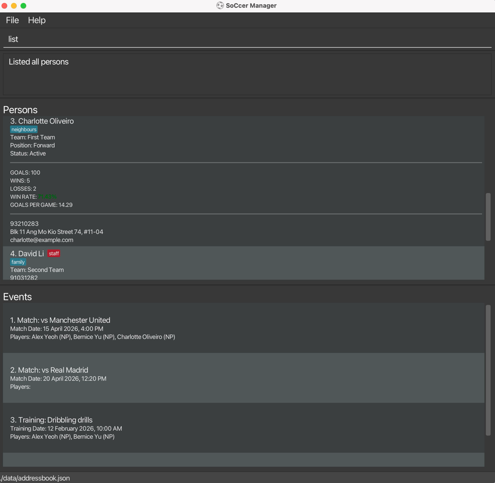

SoCcer Manager is a **desktop app for managing players and staff, optimized for use via a Command Line Interface** (CLI) while still having the benefits of a Graphical User Interface (GUI). If you can type fast, SoCcer Manager can get your team management tasks done faster than traditional GUI apps.

* Table of Contents
{:toc}

--------------------------------------------------------------------------------------------------------------------

## Quick start

1. Ensure you have Java `17` or above installed in your Computer. 
   **Mac users:** Ensure you have the precise JDK version prescribed [here](https://se-education.org/guides/tutorials/javaInstallationMac.html).

1. Download the latest `.jar` file from [here](https://github.com/AY2526S2-CS2103-F08-2/tp/releases).

1. Copy the file to the folder you want to use as the _home folder_ for your SoCcer Manager data.

1. Open a command terminal, `cd` into the folder you put the jar file in, and use the `java -jar soccermanager.jar` command to run the application. 
   A GUI similar to the below should appear in a few seconds. Note how the app contains some sample data. 
   

1. Type the command in the command box and press Enter to execute it. e.g. typing **`help`** and pressing Enter will open the help window. 
   Some example commands you can try:

   * `list` : Lists all persons.

   * `list r/player` : Lists only players.

   * `list r/staff` : Lists only staff.

   * `sort by/name` : Sorts all persons by name in ascending order.

   * `sort r/player by/email desc` : Sorts only players by email in descending order.

   * `sort by/team` : Sorts all persons by team in ascending order.

   * `sort r/staff by/status` : Sorts only staff by status in ascending order.

   * `sort r/player by/goals desc` : Sorts only players by goals in descending order.

   * `sort by/team` : Sorts all persons by team in ascending order.

   * `sort players by/goals desc` : Sorts only players by goals in descending order.

   * `filter r/player pos/Forward goals/>10` : Shows players in the Forward position with more than 10 goals.

   * `add n/John Doe r/player p/98765432 e/johnd@example.com a/John street, block 123, #01-01` : Adds a player named `John Doe` to SoCcer Manager.

   * `delete 3` : Selects the 3rd contact for deletion, then confirm with `y` or `n`.

   * `clear` : Clears all persons and events while keeping the default Team/Status/Position catalogs.

   * `exit` : Exits the app.

1. Refer to the [Features](#features) below for details of each command.

--------------------------------------------------------------------------------------------------------------------

## Features

**:information_source: Notes about the command format:** 

* Words in `UPPER_CASE` are the parameters to be supplied by the user. 
  e.g. in `add n/NAME`, `NAME` is a parameter which can be used as `add n/John Doe`.

* Items in square brackets are optional. 
  e.g `n/NAME [t/TAG]` can be used as `n/John Doe t/friend` or as `n/John Doe`.

* Items with `…`​ after them can be used multiple times including zero times. 
  e.g. `[t/TAG]…​` can be used as ` ` (i.e. 0 times), `t/friend`, `t/friend t/family` etc.

* Parameters can be in any order. 
  e.g. if the command specifies `n/NAME p/PHONE_NUMBER`, `p/PHONE_NUMBER n/NAME` is also acceptable.

* Extraneous parameters for some commands that do not take in parameters (such as `help`, `exit` and `clear`) will be ignored. 
  e.g. if the command specifies `help 123`, it will be interpreted as `help`. 
  Some fixed-format commands such as `teamlist`, `statuslist`, and `positionlist` reject extra input instead.

* If you are using a PDF version of this document, be careful when copying and pasting commands that span multiple lines as space characters surrounding line-breaks may be omitted when copied over to the application.

### Viewing help : `help`

Shows a message explaining how to access the help page.

Format: `help`

### Adding a person: `add`

Adds a player/staff to SoCcer Manager.

Format: `add n/NAME r/ROLE p/PHONE_NUMBER e/EMAIL a/ADDRESS [tm/TEAM] [st/STATUS] [pos/POSITION] [t/TAG]…​`

:bulb: **Tip:**
A person can have any number of tags (including 0)

❗The role of the contact **must be specified** (`r/player` or `r/staff`).

Notes:
* `tm/TEAM`, `st/STATUS`, and `pos/POSITION` are optional.
* If omitted, defaults are used: `Unassigned Team`, `Unknown`, `Unassigned Position`.
* If provided, `TEAM`/`STATUS`/`POSITION` must already exist in their respective catalogs
  (see [Attributes](#attributes)).
* For person assignment, input is normalized to the matched catalog entry's exact casing
  (e.g., if `teamlist` contains `third team`, then `tm/Third Team` is stored as `third team`).
  This applies to `add`/`edit` person commands.
* `pos/` is only applicable to players; staff cannot be assigned a non-default position.

Examples:
* `add n/John Doe r/player p/98765432 e/johnd@example.com a/John street, block 123, #01-01`
* `add n/Betsy Crowe r/staff t/friend e/betsycrowe@example.com a/Newgate Prison p/1234567 t/criminal`
* `add n/John Doe r/player p/98765432 e/johnd@example.com a/John street tm/First Team st/Active pos/Forward`

### Adding a match: `matchadd`

Adds a match to the address book.

Format: `matchadd n/OPPONENT_NAME d/DATE [st/STATUS | pos/POSITION | tm/TEAM] [pl/PLAYER_NAME]…​`

Notes: 
- Date must have format `yyyy-MM-dd HHmm`
- Variable number of players can be added to the match, and must exist in the address book
- Status, position and team are optional. If specified, will add all players that match ALL the parameters.

Examples:
- `matchadd n/Mancherster United d/2026-05-15 1600`
- `matchadd n/Mancherster United d/2026-05-15 1600 pl/John Doe`
- `matchadd n/Mancherster United d/2026-05-15 1600 st/Active tm/First Team`

### Adding a training session: `trainingadd`

Adds a training session to the address book.

Format: `trainingadd n/TRAINING_NAME d/DATE [st/STATUS | pos/POSITION | tm/TEAM] [pl/PLAYER_NAME]…​`

Notes:
- Date must have format `yyyy-MM-dd HHmm`
- Variable number of players can be added to the training session, and must exist in the address book
- Status, position and team are optional. If specified, will add all players that match ALL the parameters.

Examples:
- `trainingadd n/Warm Up d/2026-05-15 1600`
- `trainingadd n/Run Laps d/2026-05-15 1600 pl/John Doe`
- `trainingadd n/Passing Drills d/2026-05-15 1600 st/Active tm/First Team`

### Listing persons: `list`

Shows persons in SoCcer Manager, optionally filtered by role, team, status, and position.

Format:
* `list` (shows all persons)
* `list r/ROLE`
* `list [r/ROLE] [tm/TEAM] [st/STATUS] [pos/POSITION]`

Notes:
* `r/`, `tm/`, `st/`, and `pos/` can be combined in a single `list` command.
* Role values are case-insensitive. e.g. `list r/PLAYER`, `list r/Staff`.
* If `r/` is omitted, matching persons from all roles are shown.
* Invalid role arguments are rejected. Use only `r/player` or `r/staff`.

Examples:
* `list`
* `list r/player`
* `list r/staff`
* `list tm/First Team`
* `list r/player st/Active pos/Defender`

### Marking attendance for trainings: `attendancemark`

Marks attendance for specified players for the specified event.

Format: `attendancemark INDEX [pl/PLAYER_NAME]…​`

Notes:
- The event index provided must be a valid index.
- The players provided must exist in the addressbook and also be part of the event player list.
- Players who are not present have (NP) beside their name in the event player list. Those who are present have (P) instead.

Examples:
- `attendancemark 1 pl/Alex Yeoh`
- `attendancemark 2 pl/Alex Yeoh pl/Bernice Yu`

### Viewing attendance for trainings: `attendance`

Shows a summary of player attendance for events for every player in the address book.

Format: `attendance`

Notes: 
- There must be at least 1 event and 1 player in the address book.
- The attendance rates are rounded to one decimal place.
- Sorted in descending order, highest attendance rate shown at the top.
- If a player is not in any event, they will be skipped in the attendance report.

### Sorting persons: `sort`

Sorts persons in the UI by a supported attribute.

Format:
* `sort by/ATTRIBUTE`
* `sort r/player by/ATTRIBUTE`
* `sort r/staff by/ATTRIBUTE`
* Add optional `desc` at the end for descending order

Supported attributes:
* `name`
* `email`
* `team`
* `status`
* `position`
* `goals`
* `wins`
* `losses`

Examples:
* `sort by/name`
* `sort r/player by/email`
* `sort by/team`
* `sort by/status`
* `sort r/player by/position desc`
* `sort by/wins desc`
* `sort r/player by/goals desc`
* `sort r/staff by/name desc`

### Filtering persons: `filter`

Filters persons in the UI using structured attribute and stat criteria.

Format:
* `filter [r/ROLE] [tm/TEAM] [st/STATUS] [pos/POSITION] [goals/[>|<|=]NUM] [wins/[>|<|=]NUM] [losses/[>|<|=]NUM]`

Rules:
* All provided filters are combined using AND semantics.
* Invalid `tm/`, `st/`, or `pos/` values are rejected if they do not exist in the current catalog.
* `goals`, `wins`, and `losses` filters apply only to players.
* Use `list` to reset the filtered view and show all persons again.

Examples:
* `filter r/player`
* `filter tm/First Team st/Active`
* `filter pos/Forward goals/>10`
* `filter wins/<3`
* `filter r/player losses/=0`

### Player Stats
Every **player** will have stats that denote their individual performance. 
These stats can be modified by the user via commands.

Note: staff do not have any performance stats.

_Current valid stats: `goals`, `wins`, `losses`_

#### Set player stat: `set`
Sets a specific stat of a player to a given value.

Format: `set INDEX STAT VALUE`

Examples:
- `set 1 goals 7`
- `set 3 wins 3`

#### Update player stat: `update`
Updates a specific stat of a player by incrementing it by a given value. (can be negative)

Format: `update INDEX STAT VALUE`

Examples:
- `update 1 goals 3`
- `update 3 wins -2`

### Attributes

SoCcer Manager starts with sample team, status, and position catalog entries in a fresh setup.

Default catalogs:
* Team: `Unassigned Team`, `First Team`, `Second Team`
* Position: `Unassigned Position`, `Goalkeeper`, `Defender`, `Midfielder`, `Forward`
* Status: `Unknown`, `Active`, `Unavailable`

Catalog behavior:
* Protected defaults cannot be edited or deleted (`Unassigned Team`, `Unassigned Position`, `Unknown`).
* Deletion is blocked when the value is currently assigned to any person.
* Renaming a catalog value automatically updates all persons currently assigned that value.
* When creating catalog entries (`teamadd`/`statusadd`/`positionadd`), entered display casing is preserved.
  Matching and uniqueness checks remain case-insensitive.
* Team, status, and position names must be non-blank and may contain only letters/numbers, spaces, and hyphens.

Role applicability:
* `Team` and `Status` apply to both players and staff.
* `Position` is player-only; staff always use `Unassigned Position`.

Display behavior:
* Person cards show `Team`, `Status`, and `Position` only when the value is non-default.

For attribute catalog commands, value matching is case-insensitive. This means both `*edit` and `*delete`
commands work regardless of letter case (for example, `teamdelete reserve team` matches `Reserve Team`).

Case-only renames are supported for attribute edit commands. For example, if `R` exists in a catalog,
`teamedit old/R new/r` (and similarly for `statusedit` / `positionedit`) updates the displayed casing.

#### Listing teams: `teamlist`

Shows all teams in the team catalog.

Format: `teamlist`

Examples:
* `teamlist`

#### Adding a team: `teamadd`

Adds a team to the team catalog.

Format: `teamadd TEAM_NAME`

Examples:
* `teamadd Reserve Team`

#### Editing a team: `teamedit`

Renames an existing team in the team catalog.

Format: `teamedit old/OLD_TEAM_NAME new/NEW_TEAM_NAME`

Examples:
* `teamedit old/First Team new/Reserve Team`

#### Deleting a team: `teamdelete`

Deletes an existing team from the team catalog.

Format: `teamdelete TEAM_NAME`

Examples:
* `teamdelete Reserve Team`

#### Listing statuses: `statuslist`

Shows all statuses in the status catalog.

Format: `statuslist`

Examples:
* `statuslist`

#### Adding a status: `statusadd`

Adds a status to the status catalog.

Format: `statusadd STATUS_NAME`

Examples:
* `statusadd Rehab`

#### Editing a status: `statusedit`

Renames an existing status in the status catalog.

Format: `statusedit old/OLD_STATUS_NAME new/NEW_STATUS_NAME`

Examples:
* `statusedit old/Active new/Rehab`

#### Deleting a status: `statusdelete`

Deletes an existing status from the status catalog.

Format: `statusdelete STATUS_NAME`

Examples:
* `statusdelete Rehab`

#### Listing positions: `positionlist`

Shows all positions in the position catalog.

Format: `positionlist`

Examples:
* `positionlist`

#### Adding a position: `positionadd`

Adds a position to the position catalog.

Format: `positionadd POSITION_NAME`

Examples:
* `positionadd Winger`

#### Editing a position: `positionedit`

Renames an existing position in the position catalog.

Format: `positionedit old/OLD_POSITION_NAME new/NEW_POSITION_NAME`

Examples:
* `positionedit old/Defender new/Center Back`

#### Deleting a position: `positiondelete`

Deletes an existing position from the position catalog.

Format: `positiondelete POSITION_NAME`

Examples:
* `positiondelete Winger`

### Editing a person : `edit`

Edits an existing person in SoCcer Manager.

Format: `edit INDEX [n/NAME] [p/PHONE] [e/EMAIL] [a/ADDRESS] [r/ROLE] [tm/TEAM] [st/STATUS] [pos/POSITION] [t/TAG]…​`

* Edits the person at the specified `INDEX`. The index refers to the index number shown in the displayed person list. The index **must be a positive integer** 1, 2, 3, …​
* At least one of the optional fields must be provided.
* Existing values will be updated to the input values.
* If provided, `tm/TEAM`, `st/STATUS`, and `pos/POSITION` must already exist in their respective catalogs.
* For person assignment, input is normalized to the matched catalog entry's exact casing
  (e.g., if `teamlist` contains `third team`, then `tm/Third Team` is stored as `third team`).
* `pos/` is only applicable to players.
* If the resulting role is `staff`, any provided `pos/` is rejected.
* When editing tags, the existing tags of the person will be removed i.e adding of tags is not cumulative.
* You can remove all the person’s tags by typing `t/` without
    specifying any tags after it.

Examples:
*  `edit 1 p/91234567 e/johndoe@example.com` Edits the phone number and email address of the 1st person to be `91234567` and `johndoe@example.com` respectively.
*  `edit 2 n/Betsy Crower t/` Edits the name of the 2nd person to be `Betsy Crower` and clears all existing tags.

### Editing an event: `eventedit`

Edits an existing event in SoCcer Manager.

Format: `eventedit INDEX [n/EVENT_NAME] [et/EVENT_TYPE] [d/DATE] [pl/PLAYER_NAME]…​`

* Edits the event at the specified `INDEX`. The index refers to the index number shown in the displayed event list. The index **must be a positive integer** 1, 2, 3, …​
* At least one of the optional fields must be provided.
* `et/EVENT_TYPE` must be `MATCH` or `TRAINING`
* When editing players, the existing players will be removed i.e adding of players is not cumulative.
* You can remove all players by typing `pl/` without specifying any tags after it.

Examples:
*  `eventedit 1 et/TRAINING d/2026-01-01 1200` Edits the event type and date of the 1st event to be `TRAINING` and `2026-01-01 1200` respectively.
*  `eventedit 2 n/Barcelona pl/` Edits the name of the 2nd event to be `Barcelona` and clears all existing players involved.

### Locating persons by name: `find`

Finds persons whose names contain any of the given keywords, optionally limited by role.

Format: `find [r/ROLE] KEYWORD [MORE_KEYWORDS]`

* The search is case-insensitive. e.g `hans` will match `Hans`
* The order of the keywords does not matter. e.g. `Hans Bo` will match `Bo Hans`
* Only the name is searched.
* Prefixing with `r/player` or `r/staff` limits the results to that role.
* Only full words will be matched e.g. `Han` will not match `Hans`
* Persons matching at least one keyword will be returned (i.e. `OR` search).
  e.g. `Hans Bo` will return `Hans Gruber`, `Bo Yang`

Examples:
* `find John` returns `john` and `John Doe`
* `find r/player John` returns players whose names match `John`
* `find r/staff alex david` returns staff whose names match `alex` OR `david`
* `find staff ben` treats `staff` as a normal name keyword (general search)
* `find alex david` returns `Alex Yeoh`, `David Li` 
  

### Deleting a person : `delete`

Deletes a person from SoCcer Manager by list index or name keywords.

Format: `delete INDEX` or `delete KEYWORD [MORE_KEYWORDS]`

* `delete INDEX` selects the person at the specified `INDEX`.
* The index refers to the index number shown in the displayed person list.
* `delete KEYWORD [MORE_KEYWORDS]` searches by name (same name-matching rules as `find`).
* If one person matches, it will show that person and ask for confirmation.
* If multiple persons match, it will show a clash list with indexes. Enter the clash index to choose a person.
* To confirm or cancel deletion, type `y`/`Y` or `n`/`N`.
* The index **must be a positive integer** 1, 2, 3, …​
* Deleting a person will remove them from all events of which they are currently a part of.

Examples:
* `list` followed by `delete 2`, then `y` deletes the 2nd person in SoCcer Manager.
* `delete Bernice`, then `n` cancels deletion.
* `delete Meier`, then `2`, then `y` deletes the 2nd matched person in the clash list.

### Deleting an event : `eventdelete`

Format: `eventdelete INDEX`
* `eventdelete INDEX` selects the event at the specified `INDEX`
* The index refers to the index number shown in the displayed event list.
* The index **must be a positive integer** 1, 2, 3, …​

Examples:
* `eventdelete 2` deletes the second event in the list.

### Bulk deleting persons by tag, team, or status : `deletebulk`

Deletes all persons that share a specified tag, team, or status.

Format: `deletebulk [t/TAG | tm/TEAM | st/STATUS]`

* `deletebulk [t/TAG | tm/TEAM | st/STATUS]` filters and shows matching persons in the GUI list and CLI message.
* To confirm or cancel bulk deletion, type `y`/`Y` or `n`/`N`.
* Exactly one filter must be provided.
* Both players and staff with the specified tag, team, or status are considered.

Examples:
* `deletebulk t/graduated`, then `y` deletes all persons tagged `graduated`.
* `deletebulk tm/Reserve Team`, then `y` deletes all persons assigned to `Reserve Team`.
* `deletebulk st/Unavailable`, then `n` cancels the bulk deletion.

### Clearing all entries : `clear`

Clears all persons and events from SoCcer Manager while keeping the default Team, Status, and Position catalogs.

Format: `clear`

### Exiting the program : `exit`

Exits the program.

Format: `exit`

### Import CSV : `importcsv`

Imports contacts from a given CSV file. Expects the CSV file to follow format strictly.

> _Expected Headers (in order):_ name, role, address, phone, email, tags 

**If headers are invalid, CSV importing will fail.**

If row contains invalid fields (eg: name contains symbols, duplicates), the entire row will be skipped, but the importing process will still continue.

The relevant error messages per row will be displayed.

Format: `importcsv`

### Saving the data

SoCcer Manager data are saved in the hard disk automatically after any command that changes the data. There is no need to save manually.

### Editing the data file

SoCcer Manager data are saved automatically as a JSON file `[JAR file location]/data/addressbook.json`. Advanced users are welcome to update data directly by editing that data file.

:exclamation: **Caution:**
If your edits make the JSON file structurally invalid (e.g., broken JSON syntax), SoCcer Manager may fail to load it and start with an empty address book for that run, while restoring the default Team/Status/Position catalogs. Some malformed rows are auto-recovered (for example, by skipping invalid entries), but this is not guaranteed for all corruption cases. Hence, it is recommended to take a backup of the file before editing it. 
Furthermore, certain edits can cause SoCcer Manager to behave in unexpected ways (e.g., if a value entered is outside of the acceptable range). Therefore, edit the data file only if you are confident that you can update it correctly.

### Archiving data files `[coming in v2.0]`

_Details coming soon ..._

--------------------------------------------------------------------------------------------------------------------

## FAQ

**Q**: How do I transfer my data to another Computer? 
**A**: Install the app in the other computer and overwrite the empty data file it creates with the file that contains the data from your previous SoCcer Manager home folder.

--------------------------------------------------------------------------------------------------------------------

## Known issues

1. **When using multiple screens**, if you move the application to a secondary screen, and later switch to using only the primary screen, the GUI will open off-screen. The remedy is to delete the `preferences.json` file created by the application before running the application again.
2. **If you minimize the Help Window** and then run the `help` command (or use the `Help` menu, or the keyboard shortcut `F1`) again, the original Help Window will remain minimized, and no new Help Window will appear. The remedy is to manually restore the minimized Help Window.

--------------------------------------------------------------------------------------------------------------------

## Command summary

| Action              | Format, Examples                                                                                                                                                                                                                      |
|---------------------|---------------------------------------------------------------------------------------------------------------------------------------------------------------------------------------------------------------------------------------|
| **Add**             | `add n/NAME r/ROLE p/PHONE_NUMBER e/EMAIL a/ADDRESS [tm/TEAM] [st/STATUS] [pos/POSITION] [t/TAG]…​`   e.g., `add n/James Ho r/staff p/22224444 e/jamesho@example.com a/123, Clementi Rd, 1234665 tm/First Team st/Active t/friend` |
| **Match**           | `matchadd n/OPPONENT_NAME d/DATE [st/STATUS \| pos/POSITION \| tm/TEAM] [pl/PLAYER_NAME]…​`   e.g., `matchadd n/Mancherster United d/2026-05-15 1600 tm/First Team pl/John Doe`                                                    |
| **Training**        | `trainingadd n/TRAINING_NAME d/DATE [st/STATUS \| pos/POSITION \| tm/TEAM] [pl/PLAYER_NAME]…​`   e.g., `trainingadd n/Warm Up d/2026-06-16 1700 tm/First Team pl/John Doe`                                                         |
| **Attendance**      | `attendance`                                                                                                                                                                                                                          |
| **Attendance Mark** | `attendancemark INDEX [pl/PLAYER_NAME]…​`   e.g., `attendancemark 1 pl/Alex Yeoh pl/Bernice Yu`                                                                                                                                    |
| **Clear**           | `clear`                                                                                                                                                                                                                               |
| **Delete**          | `delete INDEX` or `delete KEYWORD [MORE_KEYWORDS]`  e.g., `delete 3` (then `y`), `delete Bernice`, `delete Meier` (then `2`, then `y`)                                                                                             |
| **Delete Bulk**     | `deletebulk [t/TAG \| tm/TEAM \| st/STATUS]`  e.g., `deletebulk st/Unavailable` (then `y` or `n`)                                                                                                                                  |
| **Edit**            | `edit INDEX [n/NAME] [p/PHONE_NUMBER] [e/EMAIL] [a/ADDRESS] [r/ROLE] [tm/TEAM] [st/STATUS] [pos/POSITION] [t/TAG]…​`  e.g.,`edit 2 n/James Lee tm/Second Team st/Unavailable`                                                      |
| **Delete Event**    | `eventdelete INDEX`   e.g., `eventdelete 3`                                                                                                                                                                                        |
| **Edit Event**      | `eventedit INDEX [n/EVENT_NAME] [et/EVENT_TYPE] [d/DATE] [pl/PLAYER_NAME]…​`  e.g.,`eventedit 2 n/Barcelona et/MATCH pl/Alex Yeoh`                                                                                                 |
| **Filter**          | `filter [r/ROLE] [tm/TEAM] [st/STATUS] [pos/POSITION] [goals/[><\|=]NUM] [wins/[>\|< \|=]NUM] [losses/[>\|<\|=]NUM]`  e.g., `filter r/player pos/Forward goals/>10`                                                                |
| **Find**            | `find [r/ROLE] KEYWORD [MORE_KEYWORDS]`  e.g., `find James Jake`, `find r/player James`, `find r/staff Alex`                                                                                                                       |
| **List**            | `list` / `list players` / `list staff`  e.g., `list players`                                                                                                                                                                       |
| **Sort**            | `sort by/ATTRIBUTE [desc]` / `sort players by/ATTRIBUTE [desc]` / `sort staff by/ATTRIBUTE [desc]`  e.g., `sort by/name desc`                                                                                                      |
| **Set**             | `set INDEX STAT VALUE`   e.g., `set 1 goals 6`                                                                                                                                                                                     |
| **Update**          | `update INDEX STAT VALUE`   e.g., `update 1 wins 1`                                                                                                                                                                                |
| **Help**            | `help`                                                                                                                                                                                                                                |
| **Team**            | `teamlist` / `teamadd TEAM_NAME` / `teamedit old/OLD_TEAM_NAME new/NEW_TEAM_NAME` / `teamdelete TEAM_NAME`  e.g., `teamadd Reserve Team`, `teamedit old/First Team new/Reserve Team`                                               |
| **Status**          | `statuslist` / `statusadd STATUS_NAME` / `statusedit old/OLD_STATUS_NAME new/NEW_STATUS_NAME` / `statusdelete STATUS_NAME`  e.g., `statusadd Rehab`, `statusedit old/Active new/Rehab`                                             |
| **Position**        | `positionlist` / `positionadd POSITION_NAME` / `positionedit old/OLD_POSITION_NAME new/NEW_POSITION_NAME` / `positiondelete POSITION_NAME`  e.g., `positionadd Winger`, `positionedit old/Defender new/Center Back`                |
| **Import CSV**      | `importcsv`                                                                                                                                                                                                                           |                                                                                                                                                                                                                                     |
