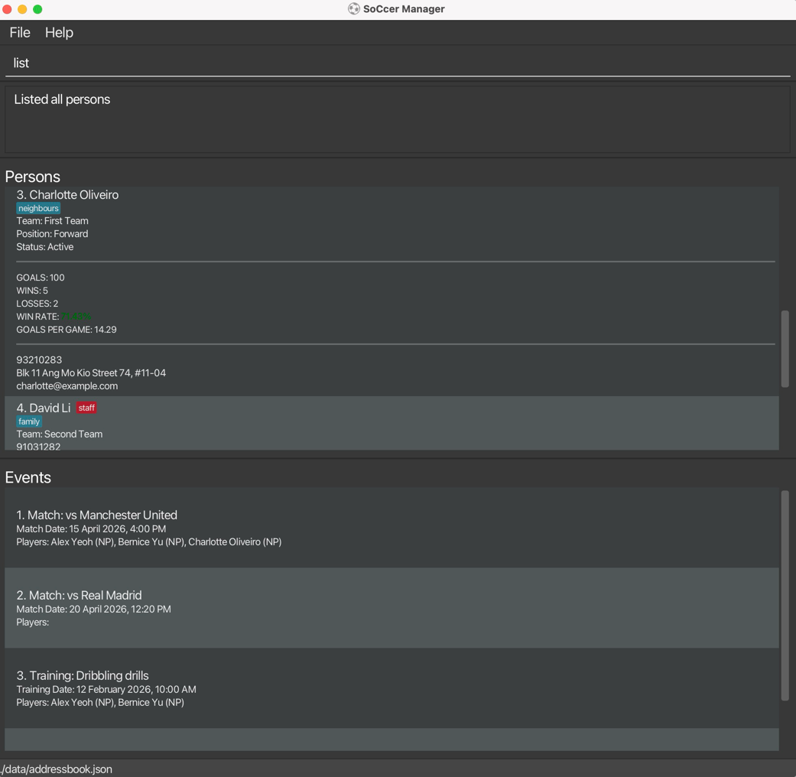

**SoCcer Manager is a CLI desktop app for soccer academy managers to track players, staff, attendance, stats, and teams.** Optimized for fast typists, it centralizes contact details with soccer-specific filtering and views. While it has a GUI, most of the user interactions happen using a CLI (Command Line Interface).

* If you are interested in using SoCcer Manager, head over to the [_Quick Start_ section of the **User Guide**](UserGuide.html#quick-start).
* If you are interested about developing SoCcer Manager, the [**Developer Guide**](DeveloperGuide.html) is a good place to start.

**Acknowledgements**

* Libraries used: [JavaFX](https://openjfx.io/), [Jackson](https://github.com/FasterXML/jackson), [JUnit5](https://github.com/junit-team/junit5)
